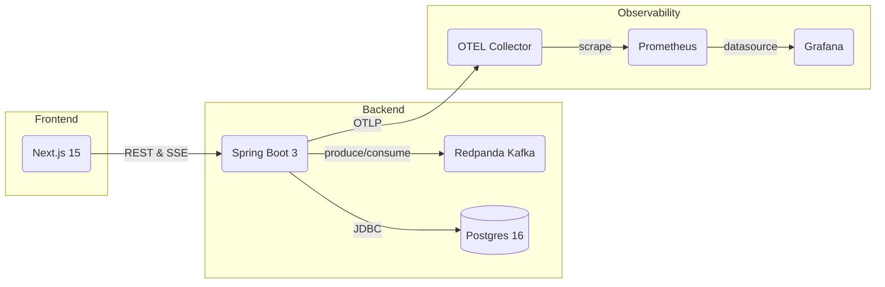

# FleetPulse 🚚📡


*A real‑time fleet monitoring platform built with **Java 21**, **Spring Boot 3**, **React / Next.js 15**, **Kafka (Redpanda)**, **PostgreSQL 16**, and a full **Prometheus + Grafana** observability stack.*

---

## ✨ Features

| ✨ | Descrição |
|----|-----------|
| **Live Map** | Veículos atualizados a cada 10 seg com **react‑leaflet** |
| **Kafka event‑driven** | Position events entram em um tópico, API publica SSE |
| **PostgreSQL** | Persistência de eventos e materialized view de status |
| **Observabilidade first‑class** | Prometheus → Grafana (dashboards) |
| **CI / CD completo** | GitHub Actions: testes (JUnit & Vitest), build imagens Docker |

---

## 🖼️ Arquitetura



---

## 🚀 Subindo localmente

```bash
git clone https://github.com/gabpaesschulz/fleetpulse
cd fleetpulse
docker compose up -d         # sobe API, Front, DB, Kafka, Prometheus, Grafana
```

| Serviço | URL | Credenciais |
|---------|-----|-------------|
| **Frontend** | <http://localhost:3000> | – |
| **API Actuator** | <http://localhost:8080/actuator> | – |
| **Grafana** | <http://localhost:3001> | admin / admin |
| **Prometheus** | <http://localhost:9090> | – |
| **Alertmanager** | <http://localhost:9093> | – |

---

## 🧑‍💻 Desenvolvimento

### Backend

```bash
cd backend/api
./mvnw spring-boot:run
```

### Frontend

```bash
cd frontend
npm install
npm run dev
```

Unit tests:

```bash
# Java
cd backend/api && ./mvnw test
# React
cd frontend && npm run test
```

---

## 📊 Observabilidade

| Dashboard | Preview |
|-----------|---------|
| **API Throughput & Latency** |  |
| **JVM Internals** |  |

*Dashboards são auto‑provisionados a partir de `infra/observability/provisioning/`.*

### Exemplos de queries PromQL

| Métrica | Query |
|---------|-------|
| Reqs/s | `sum(rate(http_server_requests_seconds_count[1m]))` |
| Latência p95 | `histogram_quantile(0.95, sum(rate(http_server_requests_seconds_bucket[5m])) by (le))` |
| Heap usado | `jvm_memory_used_bytes{area="heap"}` |

---

## 🛣️ Roadmap

- [ ] Alertas Slack (erro rate & latência)  
- [ ] Tracing visual via Jaeger / Tempo
- [ ] CD: publicar imagens em GHCR e deploy no Fly.io

---

## 📝 Licença

MIT — sinta‑se livre para usar, clonar e enviar PRs! 🙌
